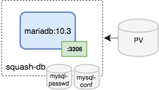

# squash-db

The SQuaSH DB microservice provides a persisten installation of `mariadb` for SQuaSH.



# Requirements

There's no additional requirements for the `squash-db` installation, however the service is meant to be used with the [squash-api](https://github.com/lsst-sqre/squash-api) and operations like database migration or loading of test data must be done from the [squash-api](https://github.com/lsst-sqre/squash-api) using Django's `manage.py`.

## Kubernetes deployment

Assuming you have `kubectl` configured to access your GCE cluster, you can deploy `squash-db` using:

```
  echo <database password> > passwd.txt
  make deployment
```

The [Kubernetes deployment](kubernetes/deployment.yaml) uses the official [`mariadb:10.3`](https://hub.docker.com/_/mariadb/) image. The
database password provided in `passwd.txt` is stored as a secret and passed to the container through the `MYSQL_ROOT_PASSWORD` environment variable. [Customized configuration](kubernetes/mysql) 
for mysql is added through a `configmap`. Finally, the persistent volume for the database is automatically created through a [volume claim](kubernetes/persistent_volume_claim.yaml).  

The environment variable `MYSQL_DATABASE` is used to create the `qadb` database used by SQuaSH during the container initialization.

## Debugging

You can inspect the deployment using:

```
kubectl describe deployment squash-db
``` 

and the `mariadb` container logs using:

```
kubectl logs deployment/squash-db mariadb
```

There is no `Cluster IP` for this service, port 3306 is target to the `squash-db` pod using the label selector. 
`squash-api` is able to ping and connect to `squash-db` pod and the image include some debug tools like `mysql` and `netcat`.

You can open a terminal inside the `squash-api` pod and connect to the database.

```
kubectl exec -it <squash-api pod> -c api /bin/bash

mysql -hsquash-db -uroot -p<database password>
```

## Restoring a copy of SQuaSH's production database

For local tests it's useful to restore a copy of the production SQuaSH database. Currently, you can get that from 
AWS S3 backups (you will need your AWS credentials). We plan to change the database backups to kubernetes, so this
[will change soon](https://jira.lsstcorp.org/browse/DM-11486).

This can be done opening a terminal inside the `squash-db` or `squash-api` pods.

```
aws s3 cp s3://jenkins-prod-qadb.lsst.codes-backups/qadb/latest.sql.gz .
gzip -d latest.sql.gz

kubectl cp latest.sql <squash-db pod>:/
kubectl exec -it <squash-db pod> /bin/bash
 
mysql -uroot -p<passwd> qadb < latest.sql
 
# The following is nedeed since the name of the django app changed 
# from 'dashboard' to 'api' in the current implementation. 
 
MariaDB [qadb]> rename table dashboard_job to api_job, dashboard_measurement to api_measurement, dashboard_metric to api_metric, dashboard_versionedpackage to api_versionedpackage;
Query OK, 0 rows affected (0.062 sec)

```
